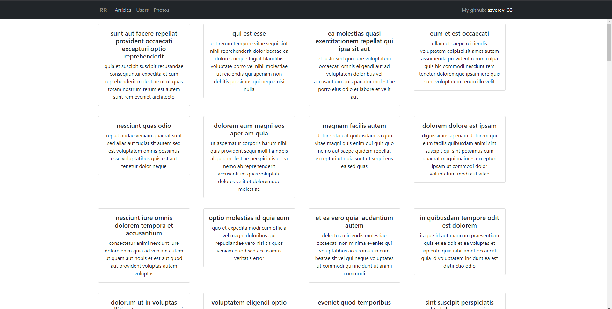

# Regular React / Redux task

This solution demonstrates the competence in the application of React library and Redux state manager for 
the implementation of SPA projects.

## Table of contents

- [Overview](#overview)
    - [The challenge](#the-challenge)
    - [Screenshot](#screenshot)
- [My process](#my-process)
    - [Built with](#built-with)
    - [Useful resources](#useful-resources)

## Overview

### The challenge

Users should be able to:

- View the optimal layout depending on their device's screen size
- View up-to-date information about articles, users and photos

### Screenshot

## My process

### Built with

- [React](https://en.reactjs.org/) - JavaScript library for building user interfaces
- [React Bootstrap](https://react-bootstrap.github.io/) - UI Kit
- [Redux](https://redux.js.org/) - State manager
- [SCSS](https://sass-lang.com/) - CSS Preprocessor

### Useful resources

- [React documentation](https://en.reactjs.org/docs/getting-started.html)
- [React Bootstrap documentation](https://sass-lang.com/documentation)
- [Redux tutorials](https://redux.js.org/tutorials/index)
- [Best practices and cheatsheets for React / Redux](https://github.com/harryheman/React-Total/blob/main/md/cheatsheets-bestpractices.md)
- [How to use useCallback](https://medium.com/swlh/how-to-use-usecallback-to-write-better-react-code-238074414881) -
  This article explains how to use useCallback correctly.
